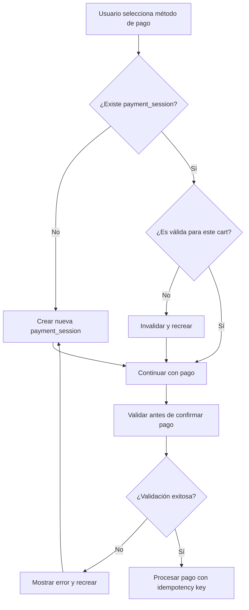

# Correcciones de Payment Session - Stripe

## Problema Identificado

Se detectó un error crítico en el sistema de pagos donde una `payment_session` de Stripe se reutilizaba entre diferentes carritos, causando:

1. **Secuencia problemática:**
   - Se creaba/capturaba un PaymentIntent exitoso en Stripe
   - Se intentaba completar OTRO carrito reutilizando la MISMA payment_session
   - El "complete" fallaba y el backend reembolsaba automáticamente
   - El backend intentaba cancelar el PI (imposible: succeeded) y re-reembolsar (ya reembolsado)

2. **Causa raíz:** El frontend permitía reutilizar la misma payment_session (payses_*) en otro cart_id

## Soluciones Implementadas

### 1. Vinculación Estricta cart_id ↔ payment_session_id

**Archivo:** `src/modules/checkout/components/payment/index.tsx`

- **Estado de seguimiento:** Se agregó un estado `paymentSessionState` que rastrea:
  - `cartId`: ID del carrito asociado
  - `paymentSessionId`: ID de la sesión de pago
  - `cartTotal`: Total del carrito
  - `cartCurrency`: Moneda del carrito
  - `cartRegion`: Región del carrito

- **Validación automática:** Se implementó `isPaymentSessionValid()` que verifica:
  - Coincidencia de cart_id
  - Coincidencia de total
  - Coincidencia de moneda
  - Coincidencia de región

### 2. Invalidación Automática de Payment Session

**Archivo:** `src/modules/checkout/components/payment/index.tsx`

- **Monitoreo de cambios:** useEffect que detecta cambios en:
  - Total del carrito
  - Moneda del carrito
  - Región del carrito

- **Invalidación automática:** Cuando se detectan cambios, se:
  - Limpia el estado de la payment session
  - Muestra mensaje al usuario: "Actualizamos tu método de pago por seguridad"
  - Requiere recreación de la sesión

### 3. Validaciones en PaymentButton

**Archivo:** `src/modules/checkout/components/payment-button/index.tsx`

- **Validación previa al pago:** Se agregó `validateCurrentPaymentSession()` que verifica:
  - Existencia de sesión activa
  - Coincidencia de cart_id
  - Estado del payment_intent (no succeeded/refunded)

- **Prevención de dobles submits:** Se implementó:
  - `isSubmittingRef` para prevenir múltiples submits simultáneos
  - Validación en el botón disabled

### 4. Utilidades de Validación

**Archivo:** `src/lib/util/payment-session-validation.ts`

Se crearon utilidades reutilizables:

- `validatePaymentSession()`: Validación completa de sesión
- `validatePaymentSessionWithFreshData()`: Validación con datos frescos del servidor
- `generateIdempotencyKey()`: Generación de claves únicas
- `hasCartChanged()`: Detección de cambios en el carrito
- `createInitialPaymentSessionState()`: Estado inicial
- `updatePaymentSessionState()`: Actualización de estado

### 5. Funciones de Caché Mejoradas

**Archivo:** `src/lib/data/cart.ts`

- `retrieveCart()`: Ahora usa `cache: "no-store"` para datos frescos
- `retrieveCartFresh()`: Nueva función para obtener datos completamente frescos
- `initiatePaymentSession()`: Invalida caché antes y después de crear sesiones
- `listCartOptions()`: También usa `cache: "no-store"`

### 6. Manejo de Errores Mejorado

- **Mensajes informativos:** Se agregaron mensajes específicos para diferentes tipos de errores
- **Recuperación automática:** Cuando se detecta una sesión inválida, se recrea automáticamente
- **UI/UX mejorada:** El usuario recibe feedback claro sobre el estado del pago

## Flujo de Validación

## Beneficios

1. **Prevención de reutilización:** Garantiza que cada payment_session pertenece a un único cart_id
2. **Detección automática:** Identifica cambios que invalidan la sesión
3. **Recuperación transparente:** El usuario no ve errores crípticos
4. **Prevención de dobles pagos:** Idempotency keys y validaciones previas
5. **Mantenibilidad:** Código modular y reutilizable

## Problemas de Caché Identificados y Corregidos

### 🚨 **Problema Crítico: Caché Agresivo**

**Problema:** La función `retrieveCart` usaba `cache: "force-cache"`, lo que causaba:
- Devolución de datos obsoletos del carrito
- Reutilización de payment sessions de carritos anteriores
- Inconsistencias entre el estado real y el estado cacheado

**Solución:** Cambiado a `cache: "no-store"` para obtener datos frescos.

### 🚨 **Problema: Falta de Invalidación de Caché**

**Problema:** `initiatePaymentSession` no invalidaba el caché antes de crear la sesión.

**Solución:** Agregada invalidación de caché antes y después de crear payment sessions.

### 🚨 **Problema: Caché de Shipping Options**

**Problema:** Shipping options también usaba caché agresivo.

**Solución:** Cambiado a `cache: "no-store"`.

## Archivos Modificados

- `src/modules/checkout/components/payment/index.tsx`
- `src/modules/checkout/components/payment-button/index.tsx`
- `src/lib/util/payment-session-validation.ts` (nuevo)
- `src/lib/data/cart.ts` (correcciones de caché)

## Testing Recomendado

1. **Cambio de carrito:** Verificar que al cambiar de carrito se invalida la sesión
2. **Cambio de total:** Modificar cantidad y verificar invalidación
3. **Cambio de región:** Cambiar región y verificar invalidación
4. **Doble submit:** Intentar múltiples clicks rápidos en el botón de pago
5. **Navegación:** Verificar comportamiento al navegar entre pasos del checkout

## Monitoreo

Se recomienda monitorear:
- Frecuencia de invalidaciones de payment_session
- Errores de "payment session no válida"
- Tiempo de recreación de sesiones
- Tasa de éxito de pagos después de las correcciones
